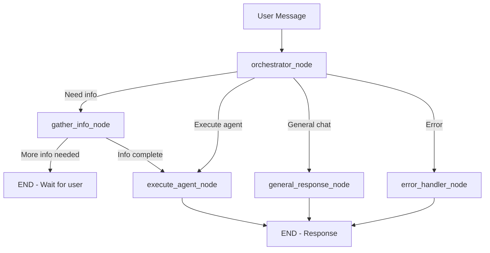

# Legion - LangGraph-Based Magentic Orchestrator

> **Advanced multi-agent orchestration system implementing Microsoft's Magentic Orchestrator pattern**

[](https://www.python.org/downloads/)
[](https://github.com/langchain-ai/langgraph)
[]()

## 📖 Table of Contents

- [Overview](#overview)
- [Features](#features)
- [Architecture](#architecture)
- [Quick Start](#quick-start)
- [Agent Types](#agent-types)
- [Configuration](#configuration)
- [Advanced Features](#advanced-features)
- [API Usage](#api-usage)
- [Development](#development)
- [Deployment](#deployment)
- [Migration Guide](#migration-guide)

---

## 🎯 Overview

Legion is a production-ready implementation of the **Microsoft Magentic Orchestrator pattern** using [LangGraph](https://github.com/langchain-ai/langgraph). It provides:

- **Graph-based orchestration** - StateGraph with conditional routing
- **Dynamic agent creation** - Agents created at runtime based on task needs
- **Task-based tool allocation** - Tools assigned per task, not per persona
- **Parallel execution** - Concurrent agent processing with dependency management
- **Automatic re-planning** - Intelligent fallback strategies when tasks fail
- **Stall detection** - Identifies and recovers from stuck tasks

### Key Differences from Traditional Systems

| Feature | Traditional | Legion (Magentic) |
|---------|-------------|-------------------|
| Orchestration | if/else chains | LangGraph StateGraph |
| Agent Creation | Static/pre-registered | Dynamic at runtime |
| Tool Allocation | Persona-based | Task-based |
| Execution | Sequential only | Parallel + dependencies |
| Failure Handling | Manual intervention | 5 auto strategies |
| State Management | Custom/racy | LangGraph checkpointing |

---

## ✨ Features

### Core Capabilities

✅ **4 Production Agents**
- Research Agent - Investigation and information gathering
- Code Agent - Programming and implementation
- Analysis Agent - Data analysis and evaluation
- Data Agent - Data processing and transformation

✅ **LangGraph Integration**
- StateGraph workflow with nodes and edges
- Conditional routing based on state
- Built-in checkpointing for persistence
- Multi-turn conversation support

✅ **Advanced Orchestration**
- Parallel agent execution (configurable workers)
- Dependency resolution with batch planning
- Automatic stall detection (timeout-based)
- Intelligent re-planning (5 strategies)

✅ **Configuration-Driven**
- YAML-based agent definitions
- Hot-reload capability
- Pydantic validation
- Global and per-agent settings

✅ **Production Ready**
- Feature flags for gradual rollout
- Backward compatible adapter layer
- Comprehensive error handling
- Extensive logging

---

## 🏗️ Architecture

### High-Level Architecture

```
┌─────────────────────────────────────────────────────────────┐
│                      User Request                            │
└───────────────────────┬─────────────────────────────────────┘
                        │
                        ▼
┌─────────────────────────────────────────────────────────────┐
│                   HermesService                              │
│  (Routes legion_mode=true to LegionGraphService)            │
└───────────────────────┬─────────────────────────────────────┘
                        │
                        ▼
┌─────────────────────────────────────────────────────────────┐
│              LegionGraphService                              │
│  (LangGraph-based multi-agent orchestration)                │
└──────────────────────┬──────────────────────────────────────┘
                        │
                        ▼ (LangGraph Path)
┌─────────────────────────────────────────────────────────────┐
│                LangGraph StateGraph                          │
├─────────────────────────────────────────────────────────────┤
│  Entry: orchestrator_node                                   │
│    ├─> AdvancedOrchestrator                                │
│    │     ├─> StallDetector                                 │
│    │     ├─> RePlanner                                     │
│    │     └─> ParallelExecutor                              │
│    │                                                        │
│    ├─> gather_info_node (multi-turn)                       │
│    ├─> execute_agent_node                                  │
│    │     ├─> AgentFactory (dynamic creation)               │
│    │     ├─> ToolAllocator (task-based)                    │
│    │     └─> Agent.execute_task()                          │
│    ├─> general_response_node                               │
│    └─> error_handler_node                                  │
└─────────────────────────────────────────────────────────────┘
                        │
                        ▼
┌─────────────────────────────────────────────────────────────┐
│                    Response                                  │
│  (with metadata: agents_used, task_ledger, etc.)            │
└─────────────────────────────────────────────────────────────┘
```

### StateGraph Flow



---

## 🚀 Quick Start

### Installation

```bash
# Install dependencies
pip install langgraph>=1.0.1 pydantic>=2.0.0 pyyaml

# Or use your existing requirements
pip install -r requirements.txt
```

### Basic Usage

```python
from app.hermes.legion import get_legion_graph_service
from app.hermes.models import UserIdentity, ResponseMode

# Get the LangGraph-based service
legion_service = get_legion_graph_service()

# Create user identity
user = UserIdentity(user_id="user123")

# Process a request
result = legion_service.process_request(
    text="Research quantum computing trends and analyze the findings",
    user_identity=user,
    response_mode=ResponseMode.TEXT,
    persona="hermes"
)

print(result.message)
print(f"Agents used: {result.metadata.get('agents_used', [])}")
```

### API Request

```bash
# Use via API with legion_mode parameter
curl -X POST http://localhost:5000/api/process_request \
  -H "Content-Type: application/json" \
  -d '{
    "request_text": "Build a REST API for user management",
    "legion_mode": true
  }'
```

---

## 🤖 Agent Types

### Research Agent
**Handles**: research, investigation, analysis tasks
**Collects**: time period, topics, depth of research
**Tools**: search, web_search, document_retrieval, summarize

```python
# Automatically used for:
"Research the latest AI developments"
"Investigate quantum computing applications"
```

### Code Agent
**Handles**: code generation, programming, debugging
**Collects**: programming language, requirements, constraints
**Tools**: python_repl, code_interpreter, linter, debugger

```python
# Automatically used for:
"Write Python code to parse CSV files"
"Implement a REST API in TypeScript"
```

### Analysis Agent
**Handles**: data analysis, evaluation, comparison
**Collects**: data source, analysis type, focus areas
**Tools**: calculator, statistical_analysis, chart_generator

```python
# Automatically used for:
"Analyze sales trends for Q4"
"Compare performance metrics"
```

### Data Agent
**Handles**: data processing, transformation, cleaning
**Collects**: data format, operation type, output format
**Tools**: data_parser, csv_reader, json_parser, sql_executor

```python
# Automatically used for:
"Convert JSON to CSV format"
"Clean and validate user data"
```

---

## ⚙️ Configuration

### Agent Configuration (agents.yaml)

```yaml
agents:
  - id: code_agent
    type: code
    description: "Code generation and programming"
    task_types: [code, programming, implementation]
    required_tools: [python_repl, code_interpreter]
    optional_tools: [linter, debugger]
    max_iterations: 10
    metadata:
      priority: high
      concurrent_limit: 2

global:
  default_timeout: 300
  max_concurrent_per_user: 5

tool_allocation:
  strategy: recommended
  max_tools_per_agent: 10
```

### Environment Variables

```bash
# LangGraph configuration
LANGGRAPH_VERBOSE_LOGGING=false    # Enable verbose logging
LEGION_CHECKPOINT_DB=conversations.db  # Checkpoint database path
```

### Loading Configuration

```python
from app.hermes.legion.config import get_config_loader

loader = get_config_loader()

# Get agent definition
agent_def = loader.get_agent_definition("code")
print(f"Max iterations: {agent_def.max_iterations}")

# Hot-reload if config changed
if loader.hot_reload():
    print("Configuration reloaded!")
```

---

## 🚀 Advanced Features

### 1. Parallel Execution

Execute multiple independent agents concurrently:

```python
from app.hermes.legion.execution import AdvancedOrchestrator

orchestrator = AdvancedOrchestrator(max_parallel_tasks=3)

# Create tasks with dependencies
task_ledger = {
    "task1": TaskInfo(...),  # Research
    "task2": TaskInfo(..., dependencies=["task1"]),  # Analysis
    "task3": TaskInfo(..., dependencies=["task1"]),  # Code
}

# Get execution plan
batches = orchestrator.get_execution_plan(task_ledger)
# Returns: [["task1"], ["task2", "task3"]]
# Batch 1: task1 runs alone
# Batch 2: task2 and task3 run in parallel
```

### 2. Stall Detection

Automatically detect stuck tasks:

```python
from app.hermes.legion.execution import StallDetector

detector = StallDetector(
    max_awaiting_minutes=30,
    max_processing_minutes=10
)

# Check for stalled tasks
stalled = detector.find_stalled_tasks(task_ledger)

for task in stalled:
    print(f"Stalled: {task.task_id}")
    print(f"Reason: {detector.get_stall_reason(task)}")
    print(f"Fix: {detector.suggest_resolution(task)}")
```

### 3. Automatic Re-planning

Intelligent fallback when tasks fail:

```python
from app.hermes.legion.execution import RePlanner

replanner = RePlanner()

if replanner.should_replan(failed_task):
    # Generate strategy (tries in order):
    # 1. Break into subtasks
    # 2. Switch agent type
    # 3. Request more information
    # 4. Simplify approach
    # 5. Escalate to user

    strategy = replanner.generate_replan_strategy(task, ledger)
    updated_ledger = replanner.apply_replan(task, strategy, ledger)
```

---

## 📡 API Usage

### Process Request

```python
POST /api/process_request
Content-Type: application/json

{
  "request_text": "Build a Python REST API",
  "response_mode": "text",
  "persona": "hermes",
  "legion_mode": true
}

Response:
{
  "message": "Here's your REST API implementation...",
  "metadata": {
    "legion_mode": true,
    "langgraph_enabled": true,
    "agents_used": ["code_agent"],
    "task_ledger": {...}
  }
}
```

### Chat Endpoint

```python
POST /api/chat
Content-Type: application/json

{
  "message": "Research quantum computing",
  "include_context": true,
  "persona": "hermes",
  "legion_mode": true
}
```

---

## 🛠️ Development

### Adding a New Agent

1. **Create agent class**:

```python
# app/hermes/legion/agents/custom_agent.py
from .base import BaseSubAgent

class CustomAgent(BaseSubAgent):
    @property
    def agent_id(self) -> str:
        return "custom_agent"

    @property
    def task_types(self) -> List[str]:
        return ["custom", "special"]

    def identify_required_info(self, task, user_message):
        return {}  # Define required fields

    def execute_task(self, state):
        # Implementation
        return "Result"
```

2. **Register in factory**:

```python
# app/hermes/legion/agents/factory.py
from .custom_agent import CustomAgent

_agent_classes = {
    "custom": CustomAgent,
    # ... existing agents
}
```

3. **Add to configuration**:

```yaml
# config/agents.yaml
agents:
  - id: custom_agent
    type: custom
    description: "Custom agent for special tasks"
    task_types: [custom, special]
    required_tools: []
    max_iterations: 5
```

### Running Tests

```bash
# Unit tests
pytest tests/unit/hermes/legion/ -v

# Integration tests
pytest tests/integration/hermes/legion/ -v

# With coverage
pytest --cov=app/hermes/legion tests/
```

---

## 🚢 Deployment

### Production Checklist

- [ ] Configure persistent checkpointing (PostgreSQL/SQLite)
- [ ] Set appropriate timeouts in `agents.yaml`
- [ ] Enable monitoring and alerting
- [ ] Test rollback procedure
- [ ] Update documentation
- [ ] Train operations team

### Deployment Strategies

See [README_DEPLOYMENT.md](./README_DEPLOYMENT.md) for detailed strategies:
- Canary deployment
- A/B testing by user
- Feature flag rollout
- Instant rollback procedures

### Monitoring

```python
# Log service type
logger.info(f"Using Legion service: {adapter.get_service_type()}")

# Track in metadata
result.metadata["service_type"] = "langgraph"
result.metadata["agents_used"] = ["research_agent", "code_agent"]
result.metadata["execution_time_ms"] = 1234
```

---

## 🔄 Migration Guide

### From Procedural to LangGraph

**Before** (Procedural):
```python
from app.hermes.legion import get_legion_service
service = get_legion_service()
```

**After** (LangGraph):
```python
from app.hermes.legion import get_legion_graph_service
service = get_legion_graph_service()
# Or use adapter (recommended)
from app.hermes.legion.adapter import get_legion_adapter
service = get_legion_adapter()  # Uses feature flag
```

### Breaking Changes

**None!** The new system is backward compatible:
- Same `process_request()` and `chat()` interface
- Feature flag controls which service is used
- Can run both services in parallel for testing

### Data Migration

LangGraph uses MemorySaver by default. For production:

```python
# TODO: Switch to persistent checkpointing
from langgraph.checkpoint.postgres import PostgresSaver

checkpointer = PostgresSaver(connection_string)
app = workflow.compile(checkpointer=checkpointer)
```

---

## 📚 Additional Documentation

- [Phase 1 & 2 Implementation](../../../.gemini/antigravity/brain/cca0c470-c871-4e2d-807e-2e319ffb9447/walkthrough.md)
- [Phase 3 Enhancements](../../../.gemini/antigravity/brain/cca0c470-c871-4e2d-807e-2e319ffb9447/phase3_summary.md)
- [Advanced Features](../../../.gemini/antigravity/brain/cca0c470-c871-4e2d-807e-2e319ffb9447/phase3.3_summary.md)
- [Deployment Guide](./README_DEPLOYMENT.md)
- [Configuration Schema](./config/agents.yaml)

---

## 🤝 Contributing

1. Create feature branch
2. Add tests for new features
3. Update documentation
4. Submit pull request

---

## 📄 License

[Your License Here]

---

## 🙏 Acknowledgments

- **Microsoft Magentic Pattern** - Orchestration architecture
- **LangGraph** - Graph-based workflow framework
- **LangChain** - LLM tooling ecosystem

---

## 📞 Support

For questions or issues:
- Check the [walkthrough documentation](../../../.gemini/antigravity/brain/cca0c470-c871-4e2d-807e-2e319ffb9447/walkthrough.md)
- Review the [deployment guide](./README_DEPLOYMENT.md)
- Contact the development team

---

**Built with ❤️ using LangGraph and the Magentic Orchestrator pattern**
