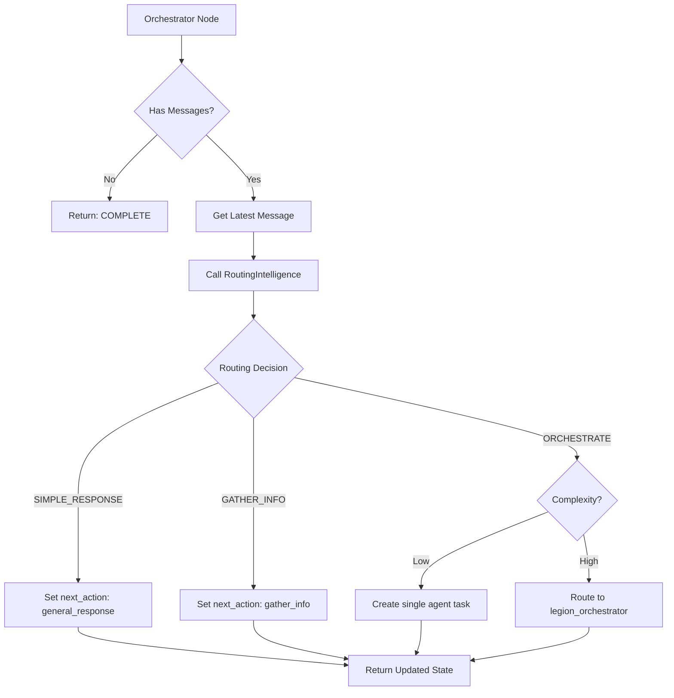
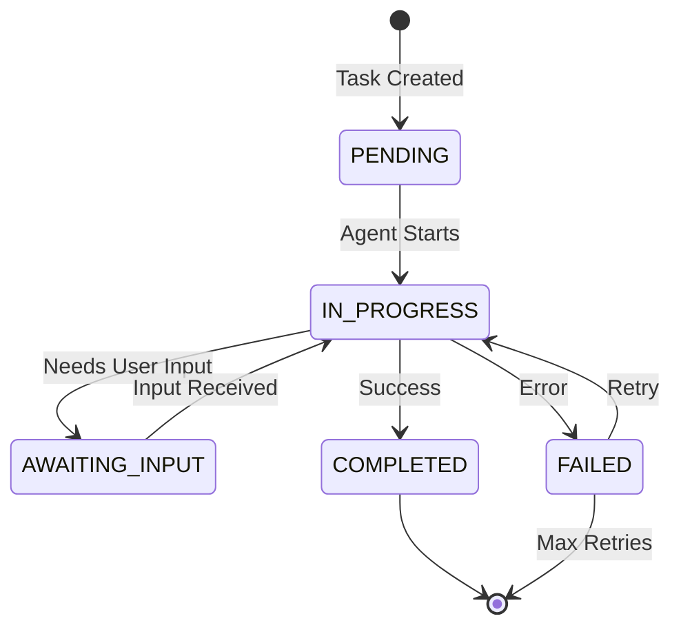
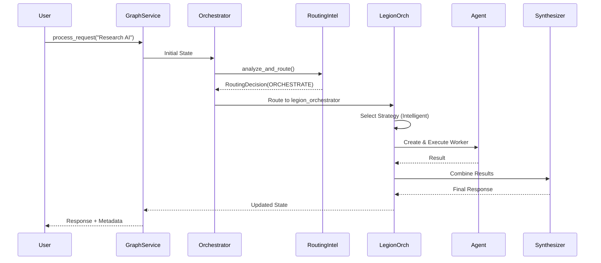
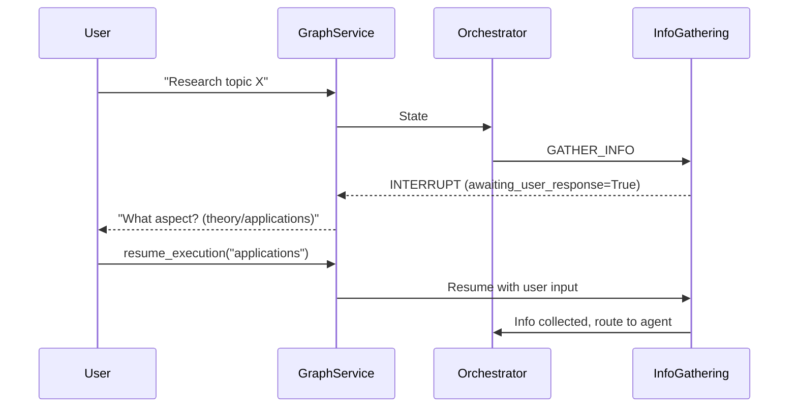

# Legion System Architecture

> **Note**: See also [README.md](./README.md) for quick start guide and [METADATA_EXAMPLES.md](./METADATA_EXAMPLES.md) for API response examples.

> **Version**: 1.0
> **Status**: Production
> **Pattern**: Magentic Orchestrator (LangGraph)
> **Last Updated**: 2025-12-01

## Table of Contents
1. [System Overview](#1-system-overview)
2. [Code Map](#2-code-map)
3. [Design Patterns](#3-design-patterns)
4. [Core Components](#4-core-components)
5. [Intelligence Layer](#5-intelligence-layer)
6. [Execution Strategies](#6-execution-strategies)
7. [Agent System](#7-agent-system)
8. [State Management](#8-state-management)
9. [Graph Execution Flow](#9-graph-execution-flow)
10. [Configuration & Extension](#10-configuration--extension)

---

## 1. System Overview

Legion is an advanced AI orchestration system designed to solve complex, multi-step problems that exceed the capabilities of a single LLM call. It implements the **Magentic Orchestrator** pattern, where a central orchestrator dynamically creates, manages, and routes tasks to a swarm of specialized sub-agents.

### Why Legion?

Traditional LLM chains are **linear** and **brittle**:
- They follow a fixed sequence of steps.
- They cannot adapt to changing user intent mid-execution.
- They cannot parallelize work.
- They lack memory of complex multi-turn interactions.

Legion solves these problems by using **LangGraph**, a framework for building stateful, multi-actor applications as **graphs** rather than chains.

### Key Capabilities

- **Non-linear execution**: Loops, conditionals, and dynamic routing based on runtime state.
- **Self-correction**: Agents can report failure, triggering replanning or alternative strategies.
- **Parallelism**: Multiple agents work concurrently on independent sub-tasks.
- **Human-in-the-loop**: The graph can interrupt execution to request user approval or additional information.
- **Persistent state**: Conversations can be paused and resumed using SQLite checkpoints.

---

## 2. Code Map

This section provides a quick reference to the key files and their responsibilities.

### Entry Points
- [`graph_service.py`](../graph_service.py) - **Main service interface**. Compiles the graph, handles persistence, and exposes `process_request()`.
- [`nodes/orchestration_graph.py`](../nodes/orchestration_graph.py) - **Graph construction**. Defines nodes, edges, and routing logic.

### Core Nodes
- [`nodes/graph_nodes.py`](../nodes/graph_nodes.py) - **All graph nodes**: `orchestrator_node`, `information_gathering_node`, `agent_executor_node`, etc.
- [`nodes/legion_orchestrator.py`](../nodes/legion_orchestrator.py) - **Legion swarm executor**. Implements the parallel/council/intelligent strategies.
- [`nodes/judge_node.py`](../nodes/judge_node.py) - **LLM Judge**. Evaluates agent outputs for quality and relevance.

### State & Models
- [`state/graph_state.py`](../state/graph_state.py) - **State schema**. Defines `OrchestratorState`, `TaskInfo`, `AgentInfo`.
- [`models.py`](../models.py) - **Supporting models**. `SubAgentState`, `RequiredInfoField`, `WorkerPlan`, etc.

### Intelligence Layer
- [`intelligence/routing_intelligence.py`](../intelligence/routing_intelligence.py) - **Routing decisions**. Determines high-level flow (simple/gather/orchestrate).
- [`intelligence/worker_planner.py`](../intelligence/worker_planner.py) - **Swarm planning**. Determines optimal worker composition.
- [`intelligence/tool_intelligence.py`](../intelligence/tool_intelligence.py) - **Tool allocation**. Assigns tools to agents.
- [`intelligence/query_analyzer.py`](../intelligence/query_analyzer.py) - **Query decomposition**. Analyzes complexity and requirements.
- [`intelligence/information_extractor.py`](../intelligence/information_extractor.py) - **Info extraction**. Extracts required info from user messages.

### Strategies
- [`strategies/base.py`](../strategies/base.py) - **Strategy protocol**. Defines `LegionStrategy` interface.
- [`strategies/intelligent.py`](../strategies/intelligent.py) - **Intelligent strategy**. Uses full intelligence layer for adaptive execution.
- [`strategies/council.py`](../strategies/council.py) - **Council strategy**. Generates diverse expert personas for debate.
- [`strategies/parallel.py`](../strategies/parallel.py) - **Parallel strategy**. Decomposes tasks for concurrent execution.

### Agents
- [`agents/base.py`](../agents/base.py) - **Base agent protocol**. Defines `BaseSubAgent` interface.
- [`agents/factory.py`](../agents/factory.py) - **Agent factory**. Creates agent instances dynamically.
- [`agents/research_agent.py`](../agents/research_agent.py) - Research specialist.
- [`agents/code_agent.py`](../agents/code_agent.py) - Coding specialist.
- [`agents/analysis_agent.py`](../agents/analysis_agent.py) - Data analysis specialist.

### Utilities
- [`utils/tool_allocator.py`](../utils/tool_allocator.py) - Tool allocation utilities.
- [`utils/conversation_memory.py`](../utils/conversation_memory.py) - Conversation summarization for context management.
- [`persistence.py`](../persistence.py) - Async SQLite persistence wrapper.

---

## 3. Design Patterns

Legion leverages several well-established design patterns to achieve flexibility and maintainability.

### 3.1 Magentic Orchestrator Pattern

**What**: A central orchestrator that doesn't execute work itself but instead creates and manages a dynamic swarm of worker agents.

**Why**: Separates decision-making (what to do) from execution (how to do it). This allows the orchestrator to adapt its strategy based on the problem without changing the execution logic.

**Where**:
- Orchestrator: [`nodes/graph_nodes.py:orchestrator_node`](../nodes/graph_nodes.py)
- Worker creation: [`agents/factory.py:AgentFactory`](../agents/factory.py)

### 3.2 StateGraph (Finite State Machine)

**What**: The entire workflow is modeled as a directed graph where nodes are functions and edges are transitions. State is passed between nodes.

**Why**: Enables complex control flow (loops, conditionals) and allows the graph to "pause" at specific points (interrupts).

**Where**:
- Graph definition: [`nodes/orchestration_graph.py:create_orchestration_graph`](../nodes/orchestration_graph.py)
- State schema: [`state/graph_state.py:OrchestratorState`](../state/graph_state.py)

### 3.3 Strategy Pattern

**What**: Encapsulates different execution algorithms (Intelligent, Council, Parallel) behind a common interface.

**Why**: Allows swapping execution strategies at runtime without changing the orchestrator logic.

**Where**:
- Protocol: [`strategies/base.py:LegionStrategy`](../strategies/base.py)
- Implementations: [`strategies/intelligent.py`](../strategies/intelligent.py), [`strategies/council.py`](../strategies/council.py), [`strategies/parallel.py`](../strategies/parallel.py)

### 3.4 Factory Pattern

**What**: The `AgentFactory` creates agent instances based on configuration, hiding the instantiation logic.

**Why**: Allows adding new agent types without modifying the orchestrator. Supports dependency injection (tools, persona).

**Where**: [`agents/factory.py:AgentFactory`](../agents/factory.py)

### 3.5 Repository/Ledger Pattern

**What**: The `task_ledger` is a centralized registry tracking the status of all tasks.

**Why**: Provides a single source of truth for task state, enabling dependency management and audit trails.

**Where**: [`state/graph_state.py:OrchestratorState.task_ledger`](../state/graph_state.py)

### 3.6 Reducer Pattern (LangGraph-specific)

**What**: State fields use "reducers" to control how updates are merged (e.g., `operator.add` for append-only lists, `deep_merge_dicts` for nested updates).

**Why**: Prevents data loss when multiple nodes update the same state field concurrently.

**Where**: [`state/graph_state.py`](../state/graph_state.py) - See `messages`, `task_ledger`, `legion_results` fields.

---

## 4. Core Components

### 4.1 Graph Service ([`graph_service.py`](../graph_service.py))

The **`LegionGraphService`** is the main entry point. It initializes the LangGraph workflow and manages the request lifecycle.

#### Key Responsibilities
1. **Graph Compilation**: Creates the StateGraph using [`create_orchestration_graph()`](../nodes/orchestration_graph.py).
2. **Persistence Management**: Uses [`LegionPersistence`](../persistence.py) (async SQLite) to checkpoint state.
3. **Execution Orchestration**: Invokes `graph.ainvoke()` or `graph.astream()`.
4. **Timeout Handling**: Enforces global timeout (`DEFAULT_ORCHESTRATION_TIMEOUT = 120s`) to prevent runaway costs.
5. **Metadata Construction**: Builds structured metadata for UI rendering.

#### Primary Methods
- **`process_request(text, user_identity, persona)`** - Main entry point for processing a user request.
- **`chat(message, user_identity, persona)`** - Simplified chat interface.
- **`resume_execution(user_id, resume_value)`** - Resumes a paused graph after user input.

#### Example Flow
```python
# From graph_service.py:process_request()
1. Create initial state with user message
2. Call _generate_ai_response_with_graph()
3. Execute graph.ainvoke(state, config)
4. Build metadata from final state
5. Return (response_content, metadata)
```

---

### 4.2 Orchestrator Node ([`nodes/graph_nodes.py:orchestrator_node`](../nodes/graph_nodes.py))

The **brain** of the system. It analyzes the current state and decides the next action.

#### Decision Flow


#### Key Logic
1. **Empty Message Check**: If no messages, complete immediately (see [`_handle_empty_message`](../nodes/graph_nodes.py)).
2. **Cancellation Detection**: Uses `RoutingIntelligence` to detect if user wants to cancel or change topic.
3. **Topic Change Detection**: If `routing_decision.topic_change_detected`, cancels active tasks (see [`_handle_topic_change`](../nodes/graph_nodes.py)).
4. **Routing Decision**: Calls [`RoutingIntelligence.analyze_and_route()`](../intelligence/routing_intelligence.py) to determine action.
5. **Agent Type Inference**: Uses [`_infer_agent_type()`](../nodes/graph_nodes.py) to determine agent type from routing metadata.

#### Decision Rationale
The orchestrator appends detailed reasoning to `decision_rationale` for explainability:
```python
rationale.append({
    "node": "orchestrator",
    "decision": "route_to_agent",
    "reasoning": "User query requires web research...",
    "agent_type": "research"
})
```

---

### 4.3 Information Gathering Node ([`nodes/graph_nodes.py:information_gathering_node`](../nodes/graph_nodes.py))

Handles **multi-turn conversation** to collect missing information.

#### How It Works
1. **Check Required Info**: If `state["required_info"]` is empty, generate it using the agent's `identify_required_info()` method.
2. **Extract Info**: Use [`InformationExtractor`](../intelligence/information_extractor.py) to parse the user's response.
3. **Validate**: Check if all required fields are collected.
4. **Loop or Proceed**: If missing info, generate follow-up questions. Otherwise, route to `agent_executor`.

#### Example
```
User: "Research quantum computing"
System: "What specific aspect? (theory/applications/hardware)"
User: "Applications in cryptography"
System: [Proceeds to agent execution with collected_info = {"aspect": "applications", "domain": "cryptography"}]
```

---

### 4.4 Agent Executor Node ([`nodes/graph_nodes.py:agent_executor_node`](../nodes/graph_nodes.py))

Executes the agent's task with collected information.

#### Execution Flow
1. **Get Current Task**: Retrieve `TaskInfo` from `task_ledger`.
2. **Load Agent**: Get agent instance from `state["agents"]` or create via `AgentFactory`.
3. **Execute**: Call `agent.execute_task(sub_agent_state)`.
4. **Update Ledger**: Mark task as `COMPLETED` or `FAILED` in `task_ledger`.
5. **Route to Judge** (Optional): If judge is enabled, route to `judge_node` for quality evaluation.

---

### 4.5 Legion Orchestrator Node ([`nodes/legion_orchestrator.py`](../nodes/legion_orchestrator.py))

Executes **multi-agent** tasks using one of the strategies (Intelligent, Council, Parallel).

#### Strategy Selection
```python
# From nodes/legion_orchestrator.py
strategy = state.get("legion_strategy", "intelligent")

if strategy == "council":
    strategy_impl = CouncilStrategy()
elif strategy == "parallel":
    strategy_impl = ParallelStrategy()
else:
    strategy_impl = IntelligentStrategy()
```

#### Execution Flow
1. **Generate Workers**: `strategy.generate_workers(query, context)` returns a list of `WorkerPlan`.
2. **Execute Workers**: For each worker, create an agent and execute its task.
3. **Synthesize Results**: `strategy.synthesize_results(query, results, persona)` combines outputs.
4. **Update State**: Store results in `legion_results`.

---

## 5. Intelligence Layer

The intelligence layer provides **cognitive services** that enhance the orchestrator's decision-making.

### 5.1 Routing Intelligence ([`intelligence/routing_intelligence.py`](../intelligence/routing_intelligence.py))

**Purpose**: Determines the high-level flow (simple response, gather info, or orchestrate agents).

#### How It Works
Uses an LLM to analyze the user's message and return a structured `RoutingDecision`:

```python
class RoutingDecision(BaseModel):
    action: RoutingAction  # SIMPLE_RESPONSE | GATHER_INFO | ORCHESTRATE
    reasoning: str
    confidence: float
    requires_agents: bool
    complexity_estimate: float
    topic_change_detected: bool
    ...
```

#### Key Features
- **Topic Change Detection**: Compares current message to previous context.
- **Complexity Estimation**: 0.0 (trivial) to 1.0 (very complex).
- **Interrupt Signals**: Can recommend `should_seek_approval` for high-risk tasks.

#### Example Prompt
```
Analyze this user message: "Research AI regulation"
Previous context: [discussing quantum computing]

Return JSON:
{
  "action": "orchestrate",
  "reasoning": "This is a new topic requiring research",
  "topic_change_detected": true,
  "complexity_estimate": 0.7
}
```

---

### 5.2 Worker Planner ([`intelligence/worker_planner.py`](../intelligence/worker_planner.py))

**Purpose**: Determines the optimal composition of the agent swarm.

#### How It Works
1. **Analyze Complexity**: Uses `QueryComplexity` to understand the problem.
2. **Generate Plan**: Uses an LLM to create a list of `WorkerPlan` objects:
```python
class WorkerPlan(BaseModel):
    worker_id: str
    role: str  # "frontend_dev", "researcher", etc.
    specialization: str
    task_description: str
    tools: List[str]
    priority: int
```

3. **Optimize Worker Count**: Adjusts the number of workers based on complexity score.

#### Example Output
```python
[
    WorkerPlan(
        worker_id="worker_0_researcher",
        role="researcher",
        specialization="AI policy",
        task_description="Research current AI regulations",
        tools=["web_search"]
    ),
    WorkerPlan(
        worker_id="worker_1_analyst",
        role="analyst",
        specialization="legal analysis",
        task_description="Analyze regulatory frameworks",
        tools=["web_search", "document_analyzer"]
    )
]
```

---

### 5.3 Tool Intelligence ([`intelligence/tool_intelligence.py`](../intelligence/tool_intelligence.py))

**Purpose**: Assigns tools to agents based on their role and task.

#### How It Works
1. **Analyze Task**: Parse the task description to identify required capabilities.
2. **Match Tools**: Use an LLM to select from available tools:
```python
available_tools = ["web_search", "file_read", "file_write", "code_executor", ...]
```
3. **Allocate**: Return a list of tool names for the agent.

#### Safety
Prevents giving "dangerous" tools (like `file_write`, `code_executor`) to agents that don't explicitly need them.

---

### 5.4 Query Analyzer ([`intelligence/query_analyzer.py`](../intelligence/query_analyzer.py))

**Purpose**: Decomposes complex queries into structured requirements.

#### Output
```python
class QueryComplexity(BaseModel):
    score: float  # 0.0 to 1.0
    dimensions: Dict[str, float]  # {"technical": 0.8, "creative": 0.2}
    suggested_workers: int
    estimated_time_seconds: float
```

---

## 6. Execution Strategies

Legion supports three execution strategies, each optimized for different problem types.

### 6.1 Intelligent Strategy ([`strategies/intelligent.py`](../strategies/intelligent.py))

The **default** strategy. Uses the full intelligence layer for adaptive execution.

#### Execution Flow
1. **Analyze**: Uses `QueryAnalyzer` to understand the problem.
2. **Plan**: Uses `WorkerPlanner` to create a custom swarm.
3. **Allocate Tools**: Uses `ToolIntelligence` to assign tools.
4. **Execute**: Creates agents via `AgentFactory` and executes tasks.
5. **Synthesize**: Uses `AdaptiveSynthesizer` to combine results.
6. **Learn** (Phase 4): Records metrics to `FeedbackLearner` for future optimization.

#### Phase 4: Self-Optimization
The strategy tracks execution history and learns from it:
- **Feedback Learner**: Records which strategies worked for which query types.
- **Performance Optimizer**: Adjusts worker counts based on past performance.
- **Cost Optimizer**: Minimizes API costs by caching similar queries.

---

### 6.2 Council Strategy ([`strategies/council.py`](../strategies/council.py))

Used for **subjective**, **complex**, or **creative** queries.

#### How It Works
1. **Persona Generation**: Uses an LLM to create 3+ diverse expert personas:
```json
{
  "personas": [
    {"name": "The Historian", "perspective": "historical context"},
    {"name": "The Futurist", "perspective": "future implications"},
    {"name": "The Skeptic", "perspective": "critical analysis"}
  ]
}
```

2. **Debate**: Each persona analyzes the query independently.
3. **Synthesis**: Combines perspectives into a balanced report.

#### Example Use Case
"Should we invest in fusion energy?"
- Historian: "Past attempts have failed, but technology has improved."
- Futurist: "Potential game-changer for clean energy."
- Skeptic: "High risk, long timeline, uncertain ROI."

---

### 6.3 Parallel Strategy ([`strategies/parallel.py`](../strategies/parallel.py))

Used for **independent sub-tasks** (Map-Reduce pattern).

#### How It Works
1. **Decompose**: Breaks query into N independent sub-queries.
2. **Map**: Executes N agents in parallel using `asyncio.gather()`.
3. **Reduce**: Aggregates all results.

#### Example
"Compare Python, JavaScript, and Rust for web development"
- Worker 1: Research Python for web dev
- Worker 2: Research JavaScript for web dev
- Worker 3: Research Rust for web dev
- Synthesizer: Combine into comparison table

---

## 7. Agent System

Agents are **ephemeral** workers created for specific tasks.

### 7.1 Agent Factory ([`agents/factory.py`](../agents/factory.py))

Dynamically instantiates agents based on configuration.

#### Registry
```python
_agent_classes = {
    "research": ResearchAgent,
    "code": CodeAgent,
    "analysis": AnalysisAgent,
    "data": DataAgent
}
```

#### Usage
```python
# From nodes/graph_nodes.py
config = AgentConfig(agent_type="research", required_tools=["web_search"])
agent = AgentFactory.create_agent(config, tools=tools, persona="hermes")
```

#### Extensibility
Add new agent types via:
```python
AgentFactory.register_agent_type("custom", CustomAgent)
```

---

### 7.2 Base Sub-Agent ([`agents/base.py`](../agents/base.py))

The protocol all agents must implement.

#### Required Methods
```python
class BaseSubAgent(ABC):
    @abstractmethod
    def execute_task(self, state: SubAgentState) -> str:
        """Execute the agent's task with collected information."""

    @abstractmethod
    def identify_required_info(self, task: str, user_message: str) -> Dict[str, RequiredInfoField]:
        """Identify what information is needed to complete the task."""
```

---

## 8. State Management

The entire system state is captured in **`OrchestratorState`** ([`state/graph_state.py`](../state/graph_state.py)).

### State Schema

| Field | Type | Reducer | Description |
|-------|------|---------|-------------|
| `messages` | `List[Message]` | `operator.add` | Append-only conversation history |
| `task_ledger` | `Dict[str, TaskInfo]` | `merge_dicts` | Registry of all tasks |
| `agents` | `Dict[str, AgentInfo]` | - | Active agent instances |
| `legion_results` | `Dict[str, Any]` | `deep_merge_dicts` | Shared memory for agent outputs |
| `required_info` | `Dict[str, RequiredInfoField]` | - | Schema for info gathering |
| `collected_info` | `Dict[str, Any]` | - | Collected user inputs |
| `next_action` | `str` | - | Routing target for next step |

### TaskInfo Lifecycle



---

## 9. Graph Execution Flow

### Complete Request Flow



### Interrupt Flow (Human-in-the-Loop)



---

## 10. Configuration & Extension

### Adding a New Tool

1. **Define the tool** in [`app/shared/utils/tools/`](../../../shared/utils/tools/).
2. **Register it** in [`ToolIntelligence.get_available_tools()`](../intelligence/tool_intelligence.py).
3. **(Optional)** Add specific routing logic in `ToolIntelligence` if it requires special handling.

### Adding a New Strategy

1. **Create a class** implementing `LegionStrategy` protocol:
```python
from ..strategies.base import LegionStrategy

class CustomStrategy(LegionStrategy):
    async def generate_workers(self, query: str, context: Dict[str, Any]) -> List[Dict[str, Any]]:
        # Implementation

    async def synthesize_results(self, original_query: str, results: Dict[str, Any], persona: str) -> str:
        # Implementation
```

2. **Register** in [`StrategyRegistry`](../strategies/registry.py).

### Adding a New Agent Type

1. **Create a class** inheriting from `BaseSubAgent`:
```python
from ..agents.base import BaseSubAgent

class CustomAgent(BaseSubAgent):
    @property
    def agent_id(self) -> str:
        return "custom_agent"

    def execute_task(self, state: SubAgentState) -> str:
        # Implementation
```

2. **Register** with the factory:
```python
AgentFactory.register_agent_type("custom", CustomAgent)
```

### Tuning Performance

Configuration constants in [`graph_service.py`](../graph_service.py):
- **`DEFAULT_ORCHESTRATION_TIMEOUT`**: Global timeout (default: 120s).
- **`MAX_MESSAGES_BEFORE_MEMORY_MANAGEMENT`**: Triggers conversation summarization (default: 50).

Configuration constants in [`nodes/orchestration_graph.py`](../nodes/orchestration_graph.py):
- **`recursion_limit`**: Max graph steps (default: 25).

---

## Appendix: Error Handling & Recovery

### Agent Failures
- If an agent fails, the `TaskInfo` is marked `FAILED`.
- The orchestrator can retry (up to `max_retries = 3`) or fail the parent task.

### LLM Judge ([`nodes/judge_node.py`](../nodes/judge_node.py))
- **(Optional)** Reviews agent outputs against the original query.
- Rejects results that don't meet quality standards, triggering retry or replanning.

### Graceful Degradation
- If the "Intelligent" strategy fails (e.g., LLM error), the system falls back to a simple LLM response via `general_response_node`.

### Timeout Handling
- If execution exceeds `DEFAULT_ORCHESTRATION_TIMEOUT`, the graph returns a partial result with available worker outputs.
- See [`_build_timeout_response()`](../graph_service.py) for implementation.

---

## Further Reading

- **LangGraph Documentation**: https://langchain-ai.github.io/langgraph/
- **Magentic Pattern**: Internal design doc at [`docs/DECISION_RATIONALE_EXAMPLE.py`](./DECISION_RATIONALE_EXAMPLE.py)
- **Multi-Agent Status**: Internal reference at [`docs/MULTI_AGENT_STATUS.py`](./MULTI_AGENT_STATUS.py)
